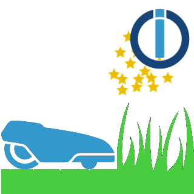

# ioBroker.smartgarden

## smartgarden adapter for ioBroker

## Control smart lawn mower from Gardena / Husqvara.
This adapter uses the latest husqvarna api to get the data for a lawn mower.

# HowTo
In order to be able to use this adapter you will need a user from husqvarna that must be created here : https://developer.1689.cloud/.
After you registered your user, you need to setup an application within the website and assign the Gardena service to it. 

Now put in your credentials and your application key in the adapter config, start the adapter and have fun !!!

Your credentials and application key will be keept in your setup, they will never be transvered to any other website beside to login with the gardena api.

## Changelog

### 0.1.0
* (Dominik Gerstner) adapter functional with constant refresh

### 0.0.1
* (Dominik Gerstner) initial release

## License
MIT License

Copyright (c) 2020 Dominik Gerstner <code@dg-home.de>

Permission is hereby granted, free of charge, to any person obtaining a copy
of this software and associated documentation files (the "Software"), to deal
in the Software without restriction, including without limitation the rights
to use, copy, modify, merge, publish, distribute, sublicense, and/or sell
copies of the Software, and to permit persons to whom the Software is
furnished to do so, subject to the following conditions:

The above copyright notice and this permission notice shall be included in all
copies or substantial portions of the Software.

THE SOFTWARE IS PROVIDED "AS IS", WITHOUT WARRANTY OF ANY KIND, EXPRESS OR
IMPLIED, INCLUDING BUT NOT LIMITED TO THE WARRANTIES OF MERCHANTABILITY,
FITNESS FOR A PARTICULAR PURPOSE AND NONINFRINGEMENT. IN NO EVENT SHALL THE
AUTHORS OR COPYRIGHT HOLDERS BE LIABLE FOR ANY CLAIM, DAMAGES OR OTHER
LIABILITY, WHETHER IN AN ACTION OF CONTRACT, TORT OR OTHERWISE, ARISING FROM,
OUT OF OR IN CONNECTION WITH THE SOFTWARE OR THE USE OR OTHER DEALINGS IN THE
SOFTWARE.
